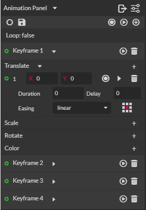

# Animation plugin for Gravit Designer

A plugin developed as a personal project to produce basic GIF animations inside Gravit Designer.

	
	
Animation panel UI

**Note:** *Currently works in developer version of Gravit Designer v3.2.6.*

### Features

List of currently supported features.

 + Transformations
    - Translate
    - Scale
    - Rotate
    - Color
 + GIF export
 + Image frame export

### TODO

+ Keyframe playback
+ Refactor source code
+ Optimize and improve performance
